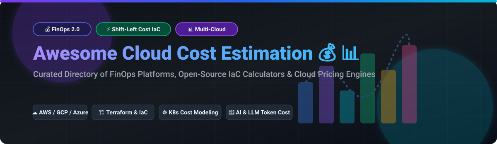

# Awesome-Cloud-Cost-Estimation

# Awesome-Cloud-Cost-Estimation 💰 📊



  





  
  
  
  
  
  



---

## 🌟 Top Cloud Cost Estimation Ecosystem

**Curated List of Commercial Cost Calculators & Open-Source Estimation Tools**  
*Focused on Shift-Left FinOps, Infrastructure-as-Code Cost Analysis, What-If Scenarios, Budget Guardrails & Self-Hosted Estimation Engines*

**Last updated: October 2026** 📅

---

### 📌 Overview & SEO Summary
Welcome to the ultimate curated directory of **cloud cost estimation platforms**, **open-source IaC cost analysis tools**, and **Shift-Left FinOps frameworks**. Whether you are looking for enterprise-grade commercial solutions (such as *AWS Pricing Calculator*, *Infracost Cloud*, and *CloudZero*), or self-hostable open-source alternatives (like *Infracost*, *c3x*, and *IONOS FinOps*), this list covers category leaders, pre-deployment cost visibility, and privacy-respecting estimation engines.

---

## 📑 Table of Contents
- [🏢 SaaS & Commercial Platforms](#-saas--commercial-platforms)
- [🔓 Open-Source GitHub Projects](#-open-source-github-projects)
- [🛠️ How to Contribute](#%EF%B8%8F-how-to-contribute)
- [📊 Star History](#-star-history)
- [🤝 Support & Sponsorship](#-support--sponsorship)
- [⚠️ Disclaimer](#%EF%B8%8F-disclaimer)

---

## 🏢 SaaS / Commercial Platforms

The cloud cost estimation market spans **free native calculators** (AWS, Google, Azure) that model hypothetical workloads before deployment, and **Shift-Left FinOps platforms** that embed cost visibility directly into the engineering workflow. **AWS Pricing Calculator** is **free** and includes **no taxes** in estimates; pricing is sourced from the **AWS Price List API** . **Google Cloud Pricing Calculator** supports **linking Cloud Billing accounts** to factor in custom contract prices, requiring **Billing Account Viewer** or **Administrator** roles . **Azure Pricing Calculator** pulls per-unit pricing from the **Azure Retail Prices API** and supports **reserved instances and savings plans** for cost reduction . **CloudZero** uses **custom pricing** with hidden costs including **Professional Services Fees ($5,000–$15,000)** and **Premium/Dedicated Support (15–25% uplift)** . **Infracost** charges for Cloud tiers but the CLI is **free and open-source** for individual use, tracking **4 million prices** across AWS, Azure, and GCP .

| SaaS / Commercial Platform | Company / Owner | Valuation / Market Cap | Standard Edition Starting Price | Free Tier / Free Trial Limits | Description |
| :--- | :--- | :--- | :--- | :--- | :--- |
| **[AWS Pricing Calculator](https://calculator.aws/)** ☁️ | Amazon | ~$2.0 Trillion | **Free service** | **Free forever** | **AWS-native estimation tool** — Model solutions before building. **Groups for hierarchical estimates**, save/share via link, export to CSV/PDF. Pricing sourced from **AWS Price List API**. No AWS account required. **Estimates exclude taxes** . |
| **[Google Cloud Pricing Calculator](https://cloud.google.com/products/calculator)** 🌐 | Google (Alphabet) | ~$2.0 Trillion | **Free service** | **Free forever** | **GCP-native estimation tool** — Estimate costs across a wide range of GCP services. **Link Cloud Billing account** for custom contract pricing (requires Billing Account Viewer/Admin role) . |
| **[Azure Pricing Calculator](https://azure.microsoft.com/en-us/pricing/calculator/)** 🔷 | Microsoft | ~$3.90 Trillion | **Free service** | **Free forever** | **Azure-native estimation tool** — Configure products with region, tier, and usage. Supports **reserved instances and savings plans**. Export to Excel. Pricing sourced from **Azure Retail Prices API** . |
| **[Infracost Cloud](https://www.infracost.io/)** 🚀 | Infracost | Private | **Custom pricing**; CLI free for individuals | **Free CLI for individuals**; Cloud trial available | **Shift-Left FinOps leader** — Shows cost impact of IaC changes in pull requests. **Issue Explorer** scans current IaC for optimizations. **AutoFix** opens PRs to correct cost issues. **Campaigns** align FinOps strategy with engineering work. Used by **3,500+ companies including 10% of Fortune 500** . |
| **[CloudZero](https://www.cloudzero.com/)** 📊 | CloudZero | Private | **Custom pricing** (usage-based) | **No free tier** | **Unit economics cost platform** — **Hidden costs: Professional Services Fees $5K–$15K, Support 15–25% uplift, Cloud Provider Configuration under $100/month**. Overage charges if cloud spend exceeds contract. Contact sales for quote . |
| **[Vantage Cost Calculator](https://www.vantage.sh/)** 💰 | Vantage | Private | **Free tier**; Pro starts at **$30/month + 3% managed spend** | **Free: 2 accounts, 10 cost reports, 5 dashboards** | **Cloud cost transparency** — Multi-cloud visibility with **savings opportunities** via Compute Optimizer, Rightsizing, and RI recommendations. Free tier is generous for small teams. |
| **[Spot by NetApp (Flexera)](https://spot.io/)** 🟢 | NetApp / Flexera | ~$20 Billion | **$1.415/100 vCPU hours** (managed compute) | **Free tier: up to 20 VMs** | **Cloud automation and optimization** — **Savings dimensions bill at $0.001, $0.15, and $0.28 per unit** — the fee climbs as the tool succeeds, making monthly totals hard to forecast . |
| **[Cast AI](https://cast.ai/)** 🎯 | Cast AI | Private | **Growth: $1,000/month base + $5/vCPU/month** | **Free (Monitoring): unlimited clusters, read-only recommendations** | **Kubernetes automation** — **Savings baseline requires 14 days of active management** before any baseline is computed. Three baseline types: **Cluster history, Peer clusters, Industry average**. Manual overrides available via representative . |
| **[Holori](https://holori.com/)** 🎨 | Holori | Private | **Custom pricing** | **Free trial available** | **AI & LLM cost management** — **Normalizes costs across OpenAI, Anthropic, Bedrock, Vertex, Azure OpenAI, and LiteLLM** alongside AWS, Azure, GCP, and OCI. **Virtual Tags** allocate AI costs across teams, projects, and customers. Real-time alerts for token spikes . |
| **[CostGo](https://costgo.io/)** 🎯 | CostGo | Private | **Custom pricing** | **Free trial available** | **Cloud cost estimation** — Focused on pre-deployment cost visibility for infrastructure changes. |

---

## 🔓 Open-Source GitHub Projects

*Sorted by GitHub_Stars_Count (Descending)* 🌟

- **[Infracost](https://github.com/infracost/infracost)**   
  **Cloud cost estimates for Terraform in pull requests**, Apache-2.0 licensed. **The leading open-source Shift-Left FinOps tool** — tracks **4 million prices** across AWS, Azure, and GCP. **Shows cost impact of IaC changes before merge** — when engineers see cost impact, they take action before money is spent . **Infracost AI** extends to **LLM cost modeling** — ingests provider billing, AI gateway data, and OpenTelemetry to build **what-if scenarios for switching to open-weight models** . **CLI, GitHub Actions, GitLab CI, VS Code, and JetBrains integrations**. Run **2,000,000+ times monthly** . 💰

- **[c3x](https://github.com/c3xdev/c3x)**   
  **Cloud cost estimation for Terraform, Terragrunt, and CloudFormation**, open-source. **Fully offline mode with no API key required** — brew install or Docker pull . **Provides optimization recommendations, budget guardrails, and what-if analysis**. Estimates monthly costs for AWS resources including **RDS, EC2, NAT Gateway, and Load Balancers**. Example output shows **$650/month** estimate with per-resource breakdown . **Shift-left capacity planning** — catch cost regressions before deployment. 🏗️

- **[IONOS FinOps](https://github.com/ionos-finops/ionos-finops)**   
  **Open-source cost estimation for IONOS Cloud infrastructure**, open-source. **Similar to Infracost but specifically for IONOS** — **100% accurate pricing calculations** before deployment . **Parses Terraform files and state** to extract IONOS resources. **Cost breakdown per resource and type**. **Diff support** compares costs between Terraform plans. **Multiple output formats**: JSON, Table, HTML. **Multi-region support** for all IONOS data centers. **CI/CD integration** for deployment pipelines. Supported resources: **VMs, Cubes, Block Storage, Object Storage, Load Balancers, DBaaS, Kubernetes, Backup** . 🎯

- **[OpenCost](https://github.com/opencost/opencost)**   
  **Open-source cost monitoring for Kubernetes**, Apache-2.0 licensed. **Originally developed and open-sourced by Kubecost**. Real-time cost allocation by cluster, node, namespace, controller, service, or pod. **Multi-cloud monitoring for AWS, Azure, GCP** with dynamic on-demand pricing from cloud billing APIs. **MCP server built into Helm chart** for AI agent access to cost queries . 🌱

- **[Kubecost Free](https://github.com/kubecost/cost-analyzer-helm-chart)**   
  **Kubernetes cost monitoring and optimization**, Apache-2.0 licensed. **Free tier: unlimited clusters, 250 cores or $100K spend cap over 30 days** . **EKS-optimized bundle is free with no spend cap** and integrates with AWS billing for accurate Savings Plans and RI reconciliation . 💰

- **[Komiser](https://github.com/tailwarden/komiser)**   
  **Cloud resource visibility and cost optimization**, Apache-2.0 licensed. **~4k+ stars**. **Multi-cloud dashboard for AWS, Azure, GCP, DigitalOcean, and Kubernetes**. Detects idle resources, orphaned volumes, and untagged assets. **Self-hosted or Komiser Cloud**. Provides the visibility needed to act on optimization opportunities . 🔍

- **[Steampipe](https://github.com/turbot/steampipe)**   
  **Query cloud APIs with SQL**, AGPL-3.0 licensed. **~7k+ stars**. **Zero-ETL approach** — query AWS, Azure, GCP, Kubernetes, and 100+ services directly. **Build custom cost reports with SQL**. The simplest way to explore cloud billing and configuration data without data pipelines . 🔗

- **[Cloud Custodian](https://github.com/cloud-custodian/cloud-custodian)**   
  **Rules engine for cloud security, cost optimization, and governance**, Apache-2.0 licensed. **~5k+ stars**. YAML-based policies for AWS, Azure, GCP. **Automated remediation**: tag enforcement (critical for cost allocation), idle resource cleanup, rightsizing, and compliance. **The most mature open-source cloud governance engine** . 🛡️

- **[AWS Cost Explorer CLI](https://github.com/aws/aws-cost-explorer-cli)**   
  **CLI for AWS Cost Explorer**, Apache-2.0 licensed. **Query cost and usage data from terminal**. Export reports, filter by service/region/tag, and integrate with scripts. **Lightweight alternative to AWS Console** for FinOps engineers. 🖥️

- **[Azure Cost CLI](https://github.com/mivano/azure-cost-cli)**   
  **CLI for Azure Cost Management**, MIT licensed. **Query Azure costs from terminal**. Daily/monthly cost breakdowns, service-level analysis, and budget tracking. **Simple, scriptable Azure FinOps**. 🔵

---

## 🛠️ How to Contribute

Contributions are welcome! Follow these steps to submit new cloud cost estimation platforms or open-source estimation software:

1. 🍴 **Fork** the repository.
2. 📝 **Add/edit** entries in `README.md` maintaining table/list structure and formatting.
3. 🔗 Include project title, official website/GitHub link, exact Stars_Count, license, and brief description.
4. 🚀 Submit a **Pull Request** with a descriptive summary of your changes.

---

## 📊 Star History



---

## 🤝 Support & Sponsorship

If you find this cloud cost estimation repository useful, please consider supporting the project:

- ⭐ **Star** this repository to increase visibility!
- 🔀 **Fork** and share with fellow FinOps engineers, platform teams, and open-source advocates.
- ☕ **Sponsor & Buy Me a Coffee**: Support ongoing open-source curation via the [GitHub Sponsor Dashboard](https://github.com/sponsors/ishandutta2007).

---

## ⚠️ Disclaimer

- This is a **community-curated** list — not exhaustive and not an endorsement. ℹ️
- **AWS Pricing Calculator estimates exclude taxes** — the tool provides estimates of AWS fees and charges, but taxes that may apply are not included .
- **CloudZero hidden costs add significantly to the quoted price** — budget for **Professional Services Fees ($5,000–$15,000)** for implementation support, **Premium/Dedicated Support (15–25% uplift)** on annual contract value, and **Cloud Provider Configuration Costs (under $100/month)** .
- **Cast AI savings baseline requires 14 days of active management** before any baseline is computed — clusters younger than this won't appear in savings reports. Three baseline types exist: **Cluster history** (7+ days of history), **Peer clusters** (org sibling averages), and **Industry average** (cross-fleet fallback). Manual overrides are available through your Cast AI representative .
- **Infracost tracks 4 million prices** across AWS, Azure, and GCP — the CLI is free for individuals, but Cloud tiers add collaboration and automation features .
- Open-source solutions (Infracost, c3x, IONOS FinOps) provide self-hosted ownership and transparency, but enterprise-grade SLA guarantees, multi-cloud price accuracy, and vendor support remain primarily commercial offerings. **Always validate estimates against actual cloud billing** after deployment — estimation tools model hypothetical workloads and may not account for all usage patterns. 💰

---



  <b>Made with ❤️ for FinOps engineers, platform teams, and open-source cost estimation advocates.</b>

